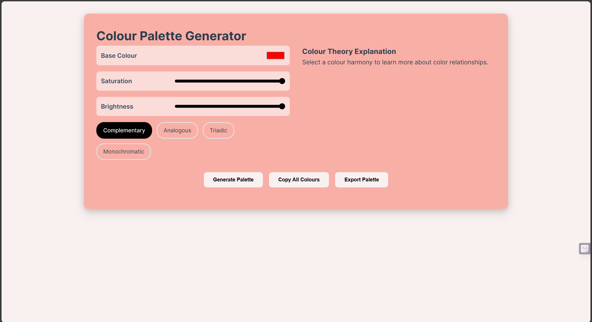

# Color Palette Generator

A dynamic web application to generate, customize, and explore color palettes. Users can create complementary, analogous, triadic, or monochromatic palettes based on a chosen base color, with adjustable brightness and saturation.

## Features

- **Base Color Selection**: Pick a base color using a color picker.
- **Saturation & Brightness Adjustment**: Fine-tune the saturation and brightness of the palette.
- **Color Harmony Modes**:
  - Complementary
  - Analogous
  - Triadic
  - Monochromatic
- **Color Theory Info**: Get an explanation for the selected color harmony.
- **Interactive Palette Display**: Visualize the generated colors with HEX and RGB values.
- **Copy & Export Options**:
  - Copy all colors to the clipboard.
  - Export the palette as a text file.

## Demo




## Technologies Used

- **HTML**: For structuring the web page.
- **CSS**: For responsive design and styling.
- **JavaScript**: For implementing functionality like palette generation, event handling, and exporting data.

## Getting Started

### Prerequisites
- A modern web browser.

### Installation
1. Clone the repository:
   ```bash
   git clone https://github.com/yourusername/Colour-Pallete-Generator.git
   ```
2. Navigate to the project directory:
   ```bash
   cd Colour-Palette-Generator

   ```
3. Open color.html in your browser to run the application.

## Future Enhancements
 
 - Add more color harmony modes.
 - Enable palette sharing via social media.
 - Include accessibility features like WCAG contrast checks.
 - Support custom naming for exported palettes.

## License
This project is licensed under the MIT License.

## Contributions
Contributions, issues, and feature requests are welcome!
